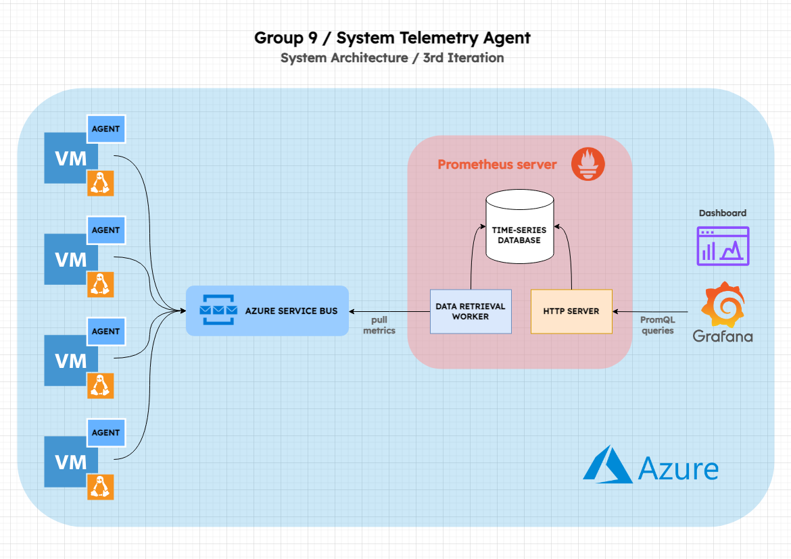

# System-Telemetry-Agent

System Telemetry Agent is a tool built for Microsoft as part of Trinity SwEng 2024. Our product will allow a server engineer to monitor a group of servers live and assess a network’s health. It will provide a clean dashboard interface for users to understand the overall state of servers on a network and monitor each node individually. 

The issue of monitoring is common in cloud computing. When a system scales horizontally and is composed of several nodes, it becomes crucial to find an efficient and reliable way to quickly identify faults and react to critical conditions by sending alerts or re-allocate resources. For example, if a node runs out of memory, there should be a way for the system to detect the source of the outage without having to manually trace back the effects throughout the network. Tools like Prometheus - a key component in our solution, achieve this by regularly pulling metrics from target endpoints and triggering alerts when a node exposes critical metrics. 

### Functional Requirements

In order to meet this vision, the project will have to address the following set of functional requirements:

* Develop a monitoring agent that runs on a target machine and collects system metrics
* The agent should support collection of the following metrics:
    * CPU: temperature, frequency, utilization (%)
    * RAM: utilization (%)
    * Disk / Storage (OS drive): capacity (used vs. unused)
    * Networking: in traffic (Mb/s), out traffic (Mb/s)
* The agent should run on Linux machines
* The monitoring process should be lightweight to avoid an 'observer effect'
* The metrics are to be displayed to the end user in real-time on an interactive dashboard
* The system should scale to support N machines

### System Architecture

The following diagram shows the different components of the product we are aiming for. The goal is to have our Python agent run on N Ubuntu-based virtual machines, all hosted on Microsoft Azure. The metrics are exposed on each individual machine, pulled and queued into Azure Service Bus and stored into one single instance of Prometheus server (also hosted on the cloud).

We plan to achieve this architecture incrementally by first simulating locally the Azure setup using a set of Ubuntu containers orchestrated by Docker. Then we will test the agent on one hosted VM and include the service bus when we feel comfortable moving to N machines.

### The Team

#### Team Leads:

Dmitry Kryukov - 3rd Year 

Kostiantyn Ohorodnyk - 3rd Year

Massimiliano Romagnoli - 3rd Year

Liam Zone - 3rd Year

Qiming Nie - 3rd Year

---
#### Frontend:

Ayomide Oyelakun - 2nd Year

Binli Wang - 2nd Year

---
#### Backend:

Leila Adil - 2nd Year

Cindy Ariyo - 2nd Year

Victor Dalessandris - 2nd Year

Claire McCooey - 2nd Year
